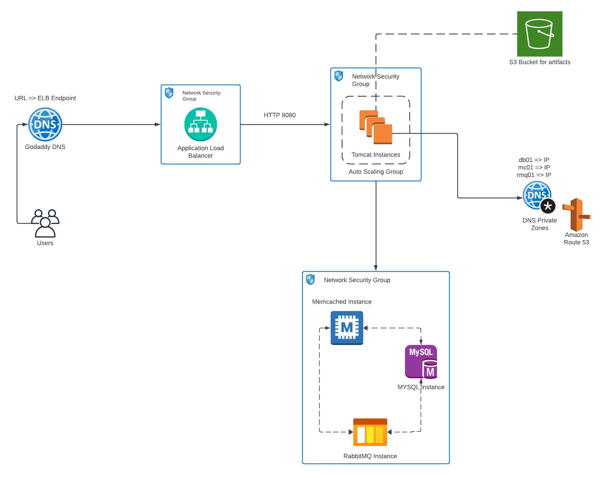

## Table of contents
* [General info](#general-info)
* [Application Tech Stack](#application-tech-stack)
* [Cloud Technologies](#cloud-technologies)
* [Setup](#setup)

## General info
This project facilitates the migration of a locally hosted Multi-Tier Web Application to the AWS Cloud, using a proven strategy known as "Lift and Shift" while taking full advantage of the robust AWS service ecosystem.

## Application Tech Stack
  - JDK 1.8 or later
  - Maven 3 or later
  - MySQL 5.6 or later
  - Spring MVC
  - Spring Security
  - Spring Data JPA
  - Maven
  - JSP
  - MySQL
    -MSQL DB Installation Steps for Linux ubuntu 14.04:
      - $ sudo apt-get update
      - $ sudo apt-get install mysql-server
        Then look for the file :
      - /src/main/resources/accountsdb
      - accountsdb.sql file is a mysql dump file.we have to import this dump to mysql db server -> mysql -u <user_name> -p accounts < accountsdb.sql

## Cloud Technologies
Here's how this project uses AWS services for an efficient migration:
* ## Amazon EC2 Instances
We begin by replicating on-premises/localized servers as Amazon EC2 instances. This provides a virtualized environment to run your application within the AWS Cloud.

* ## Amazon Elastic Load Balancing (ELB)
To enhance the availability and distribution of incoming traffic, Amazon ELB is used to distribute requests across multiple EC2 instances. This ensures high availability and optimal performance.

* ## Amazon S3 for Artifact Storage
Amazon S3 serves as the ideal repository for storing application artifacts and other critical data. It's a scalable and durable solution designed for efficient object storage.

* ## Amazon Route 53 for DNS Management
Route 53 is used to establish a private DNS zone, enabling efficient and secure domain name resolution for your application within the AWS environment.

* ## Autoscaling with Autoscaling Groups
We set up Autoscaling groups to automatically adjust the number of EC2 instances based on traffic demand. This ensures that our application can handle varying workloads without manual intervention.

## Setup
* ## Architectural Overview
  - Access the application via a URL configured in GoDaddy DNS, pointing to an endpoint.
  - ACM manages HTTPS encryption for secure communication.
  - The Load Balancer, secured with HTTPS, forwards requests to Tomcat instances.
  - Auto Scaling dynamically manages the capacity of Tomcat instances.
  - Backend servers (MySQL, Memcache, RabbitMQ) are identified using Route 53 private DNS zones.

* ## Steps
  - Use EC2 instances for hosting Tomcat, Memcache, RabbitMQ, and MySQL services and configure an Elastic Load Balancer for distributing traffic.
  - Implement Auto Scaling using target groups to dynamically adjust the capacity of EC2 instances based on load.
  - Use Amazon S3 for storing software artifacts.
  - Use Amazon Certificate Manager (ACM) for managing SSL certificates and employ Route 53 for DNS management and configure private DNS zones.
  - Apply security groups to:
    - Restrict HTTPS traffic to the Load Balancer.
    - Allow communication on Port 8080 from the Load Balancer to Tomcat instances.
    - Secure backend instances running MySQL, Memcache, and RabbitMQ with proper inbound security group rules.
  - Finally, route user requests through the Load Balancer to Tomcat instances for optimal load distribution.
